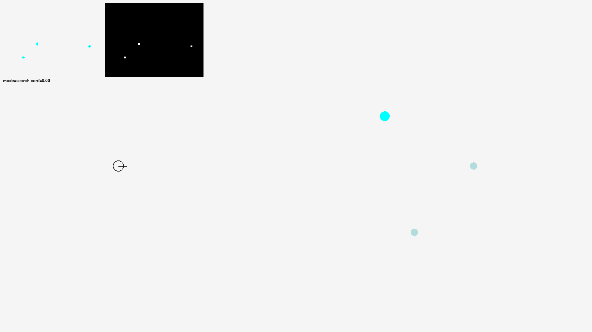

# Robotics 2D Perception and Control System

[](https://www.python.org/downloads/)
[](LICENSE)

A complete implementation of a 2D differential-drive robot simulation featuring a closed-loop perception and control system. This project demonstrates autonomous navigation, target detection, and state-machine-based control strategies.

## Table of Contents
- [Overview](#overview)
- [Features](#features)
- [Demo](#demo)
- [System Architecture](#system-architecture)
- [Installation](#installation)
- [Usage](#usage)
  - [Quick Start](#quick-start)
  - [Running Modes](#running-modes)
  - [Command-Line Options](#command-line-options)
- [Project Structure](#project-structure)
- [Configuration](#configuration)
- [Testing and Evaluation](#testing-and-evaluation)
- [Technical Details](#technical-details)
- [Future Enhancements](#future-enhancements)
- [License](#license)

## Overview

This project implements a virtual 2D autonomous robot that demonstrates the complete perception-control-action pipeline used in real robotics systems. The robot navigates through a simulated environment to sequentially reach multiple targets while avoiding distractors and obstacles.

**Pipeline:** `Sense -> Perceive -> Control -> Act`

The system simulates realistic challenges including:
- Sensor noise and measurement uncertainty
- Perception latency
- Limited field-of-view constraints
- Dynamic decision-making under uncertainty

## Features

### Core Capabilities
- **Geometry-based Robot-Centric Camera**: Projects targets, distractors, and obstacles within a limited FOV for realistic perception simulation
- **Computer Vision Perception**: HSV color thresholding with morphological operations, contour filtering, and confidence scoring
- **State Machine Control**: Three-state FSM (SEARCH/TRACK/APPROACH) with adaptive speed scheduling
- **Differential Drive Simulation**: Realistic kinematics for a two-wheeled robot with configurable constraints
- **Robustness Features**: Configurable perception latency, measurement noise, and exponential smoothing

### Environment
- Sequential target navigation (targets disappear upon reaching)
- Optional cyan distractors to test robustness
- Static obstacles for collision detection scenarios
- High-resolution visualization (1920x1080)

### Output & Analysis
- Per-step CSV telemetry logging (pose, commands, detections, errors, control mode)
- GIF capture for visualizations
- Batch evaluation with performance metrics export
- Debug overlay showing camera FOV, detection masks, and state information

## Demo



*The robot autonomously navigates to sequential targets using vision-based perception and finite-state machine control.*

## System Architecture

```
+-------------+    +--------------+    +-------------+    +----------+
|   Camera    |--->|  Perception  |--->|   Control   |--->|  Robot   |
|  (Sensing)  |    |   (Vision)   |    |    (FSM)    |    | (Action) |
+-------------+    +--------------+    +-------------+    +----------+
      |                    |                   |                  |
      |                    |                   |                  |
      +--------------------+-------------------+------------------+
                                  |
                          +-------v--------+
                          |  World State   |
                          |  (Simulation)  |
                          +----------------+
```

### Key Components

1. **Simulation** ([src/sim.py](src/sim.py)): World state management, robot kinematics, target/obstacle handling
2. **Perception** ([src/perception.py](src/perception.py)): Color-based target detection with OpenCV
3. **Control** ([src/control.py](src/control.py)): Finite-state machine with heading control
4. **Estimation** ([src/estimation.py](src/estimation.py)): Sensor fusion and smoothing algorithms
5. **Rendering** ([src/render.py](src/render.py)): Pygame-based visualization with debug overlays

## Installation

### Prerequisites
- Python 3.8 or higher
- pip package manager
- (Optional) Virtual environment tool

### Setup Instructions

1. **Clone the repository**
   ```bash
   git clone https://github.com/OctaviusLeo/robotics-2d-perception-control.git
   cd robotics-2d-perception-control
   ```

2. **Create and activate a virtual environment** (recommended)
   
   **Windows:**
   ```bash
   python -m venv .venv
   .venv\Scripts\activate
   ```
   
   **macOS/Linux:**
   ```bash
   python -m venv .venv
   source .venv/bin/activate
   ```

3. **Install dependencies**
   ```bash
   pip install -r requirements.txt
   ```

### Dependencies
- `numpy>=1.24.0` - Numerical computations
- `pygame>=2.5.0` - Visualization and simulation loop
- `opencv-python>=4.8.0` - Computer vision and image processing
- `imageio>=2.31.0` - GIF generation

## Usage

### Quick Start

Run the default demo with distractors and obstacles:
```bash
python src/run_demo.py
```

### Running Modes

#### 1. Clean Deterministic Run
Perfect conditions for algorithm validation:
```bash
python src/run_demo.py --steps 2000 --seed 0 --no-distractors --no-obstacles --camera-mode robot --debug-overlay
```

#### 2. Generate Clean Demo GIF
One-command setup for the demo shown above:
```bash
python src/run_demo.py --clean-gif
```

#### 3. Headless Mode with Logging
Run without GUI and save telemetry + GIF:
```bash
python src/run_demo.py --headless --steps 600 --log-csv outputs/run1.csv --save-gif --gif-path outputs/run1.gif
```

#### 4. Stress Test with Latency & Noise
Test robustness under realistic sensor conditions:
```bash
python src/run_demo.py --headless --steps 600 --perception-latency 3 --meas-noise-px 2.0 --smooth-alpha 0.4 --log-csv outputs/run_latency.csv
```

#### 5. Batch Evaluation
Run multiple episodes and collect performance metrics:
```bash
python src/eval.py --episodes 10 --steps 600 --camera-mode robot --no-distractors --no-obstacles --metrics-csv outputs/metrics.csv
```

### Command-Line Options

| Flag | Description |
|------|-------------|
| `--headless` | Run without GUI window (uses dummy video driver) |
| `--steps N` | Number of simulation steps (60 steps ≈ 1 second) |
| `--seed N` | Random seed for reproducible runs |
| `--log-csv PATH` | Save per-step telemetry to CSV file |
| `--save-gif` | Capture simulation as GIF |
| `--gif-path PATH` | Output path for GIF file |
| `--clean-gif` | Quick command to generate clean demo GIF |
| `--perception-latency N` | Add N frames of detection delay |
| `--meas-noise-px FLOAT` | Gaussian pixel noise std deviation |
| `--smooth-alpha FLOAT` | Exponential smoothing factor (0-1) |
| `--no-distractors` | Disable cyan distractor objects |
| `--no-obstacles` | Disable static obstacles |
| `--debug-overlay` | Show camera FOV, masks, and state info |
| `--camera-mode MODE` | Choose `robot` (geometry) or `global` (full scene) |

## Project Structure

```
robotics-2d-perception-control/
├── assets/                    # Demo GIFs and visual assets
│   └── clean-run.gif
├── outputs/                   # Generated logs and visualizations
│   ├── logs/
│   └── sanity_logs/
├── src/                       # Source code
│   ├── __init__.py
│   ├── config.py             # Simulation configuration parameters
│   ├── control.py            # FSM controller and heading control
│   ├── estimation.py         # Smoothing and filtering algorithms
│   ├── eval.py               # Batch evaluation script
│   ├── perception.py         # Vision-based target detection
│   ├── render.py             # Pygame visualization
│   ├── run_demo.py           # Main demo entry point
│   └── sim.py                # Physics and world simulation
├── requirements.txt          # Python dependencies
├── LICENSE                   # MIT License
└── README.md                 # This file
```

## Configuration

Key parameters can be adjusted in [src/config.py](src/config.py):

```python
SimConfig:
    # World
    width: 1920 px
    height: 1080 px
    dt: 1/60 s (60 Hz simulation)
    
    # Robot
    wheel_base: 40.0 px
    v_max: 140.0 px/s (linear velocity limit)
    w_max: 3.2 rad/s (angular velocity limit)
    
    # Camera
    cam_w: 160 px
    cam_h: 120 px
    cam_fov: 1.2 rad (~69 degrees)
    
    # Target
    target_radius: 16 px
```

## Testing and Evaluation

### Running Evaluations

The [src/eval.py](src/eval.py) script provides batch testing capabilities:

```bash
python src/eval.py --episodes 20 --steps 800 --metrics-csv outputs/metrics.csv
```

### Output Metrics

The metrics CSV includes (per episode):
- success
- steps
- sim_time_s
- distance_initial
- distance_final
- detection_rate
- avg_v_cmd
- avg_w_cmd
- runtime_s

### Analyzing Logs

Per-step CSV logs contain:
```
step, sim_time_s, robot_x, robot_y, robot_theta, target_x, target_y, distance_to_target,
v_cmd, w_cmd, detected, detected_cx, detected_cy, detect_conf, err_norm, err_norm_filtered,
mode, holding_estimate
```

Use with pandas/matplotlib for detailed analysis:
```python
import pandas as pd
df = pd.read_csv('outputs/run1.csv')
# Analyze trajectory, control behavior, detection performance
```

## Technical Details

### Perception Pipeline
1. **Camera Projection**: Geometry-based FOV projection of world objects
2. **Color Segmentation**: HSV thresholding for target color (red)
3. **Morphological Operations**: Opening to remove noise
4. **Contour Analysis**: Filter by area and aspect ratio
5. **Confidence Scoring**: Based on size and shape metrics

### Control Architecture
- **State: SEARCH** - Rotate in place until target detected
- **State: TRACK** - Align heading with target while moving slowly
- **State: APPROACH** - Move toward target at maximum speed
- Transitions based on detection confidence and heading error thresholds

### Robustness Features
- **Latency Simulation**: Queue-based delay of perception outputs
- **Measurement Noise**: Gaussian noise added to pixel coordinates
- **Exponential Smoothing**: Filters heading error for stable control

## Future Enhancements

- Replace color thresholding with learned CNN detector
- Implement obstacle avoidance using reactive control or path planning
- Add trajectory tracking task with waypoint following
- Integrate SLAM for environment mapping
- Support for dynamic obstacles and multi-robot scenarios
- ROS2 integration for hardware deployment

## License

This project is licensed under the MIT License - see the [LICENSE](LICENSE) file for details.

For questions or collaboration: OctaviusLeo
